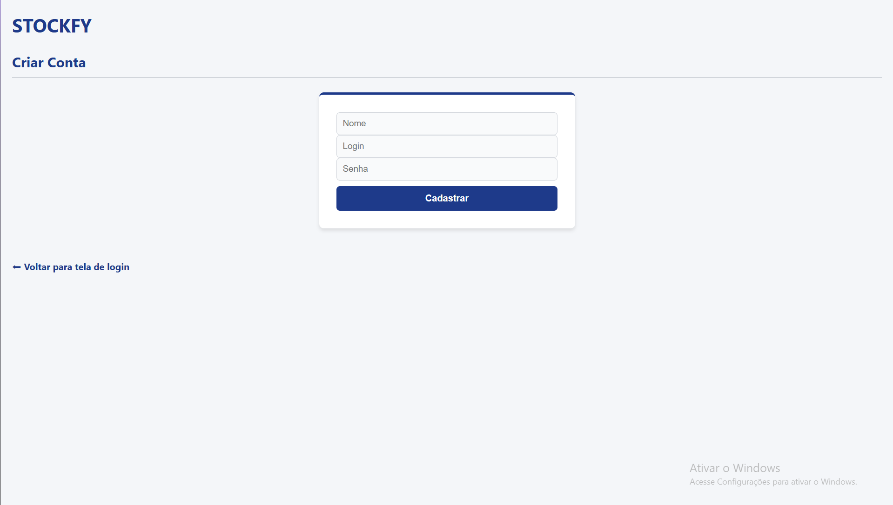

## Estoqueria

Sistema web de controle de estoque desenvolvido em PHP e MySQL para auxiliar empresas no gerenciamento de produtos, movimentações e monitoramento de estoque.

## Funcionalidades

- Login de usuários
- Cadastro de usuários
- Cadastro de produtos
- Controle de entrada e saída de estoque
- Dashboard com indicadores
- Busca de produtos
- Configuração de e-mail para alertas
- Notificações automáticas de estoque baixo

## Como Executar o Projeto

1. Instale o XAMPP.
2. Inicie o Apache e o MySQL.
3. Clone este repositório.
4. Importe o arquivo `estoqueria.sql` no phpMyAdmin.
5. Configure as credenciais do banco em `funcao_alerta.php`.

## Sistema de Alertas

O sistema monitora automaticamente a quantidade mínima dos produtos cadastrados.

Quando o estoque de um produto atinge ou fica abaixo do limite definido, uma notificação é enviada para o e-mail configurado na área de Configurações.

## Tecnologias

- PHP
- PHPMailer
- HTML
- CSS
- MySQL

## Criar Conta

## Login

## Dashboard

## Cadastro de Produtos

## Estoque

## Movimentações

## Configurações

