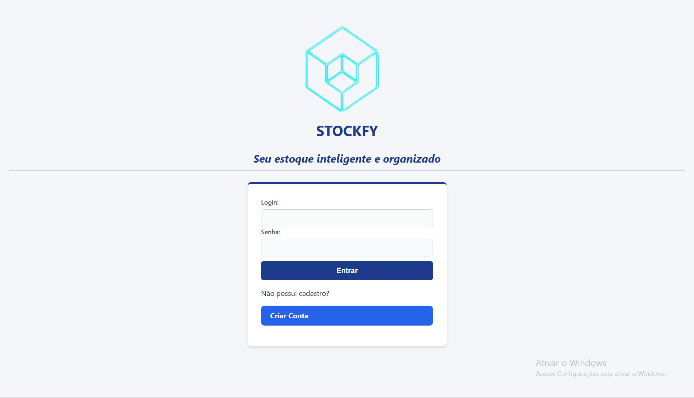
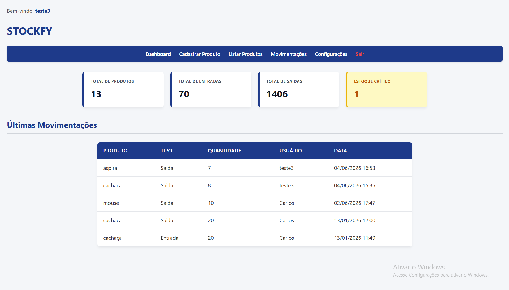
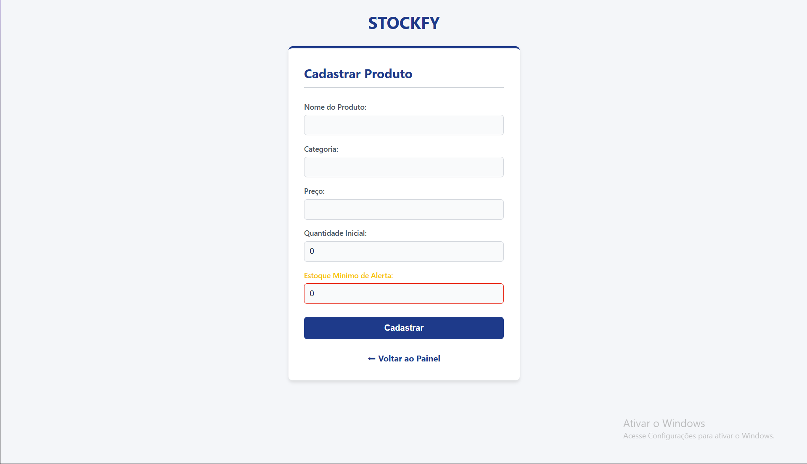
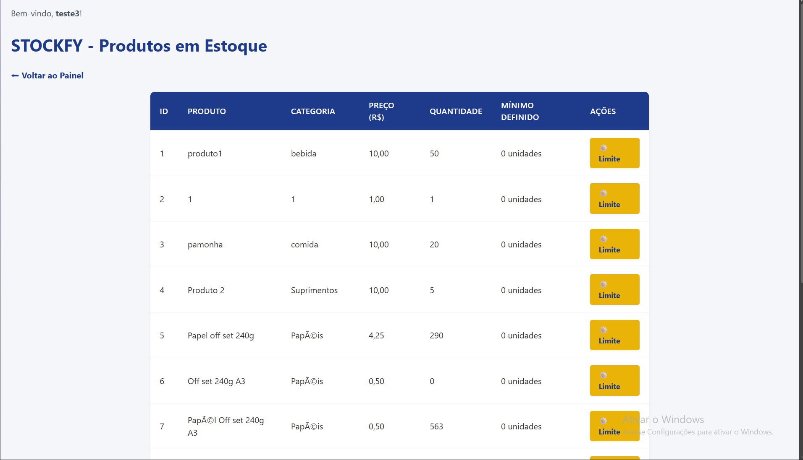
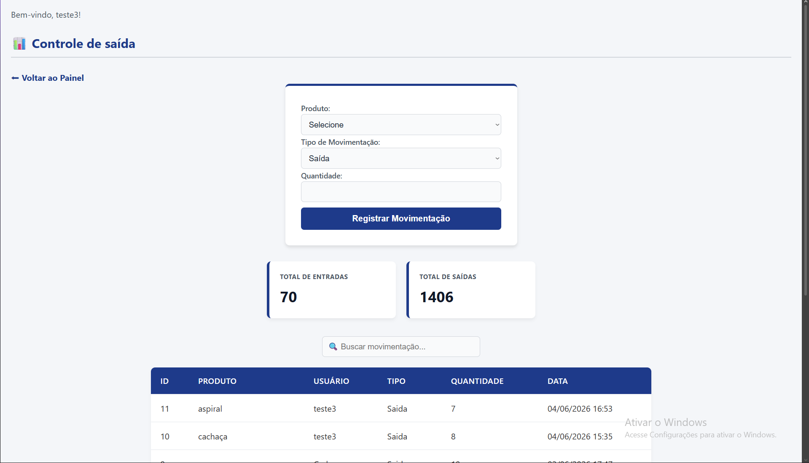
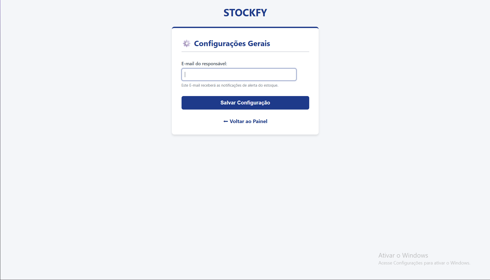

# Estoqueria

Sistema web de controle de estoque desenvolvido em PHP e MySQL.

# Funcionalidades

- Login de usuários
- Cadastro de produtos
- Controle de entrada e saída
- Dashboard
- Busca de produtos
- Notificações de estoque baixo (em desenvolvimento)

# Login

# Dashboard

# Cadastro de Produtos

# Estoque

# Movimentações

# Configurações

# Tecnologias

- PHP
- MySQL
- HTML
- CSS
- JavaScript